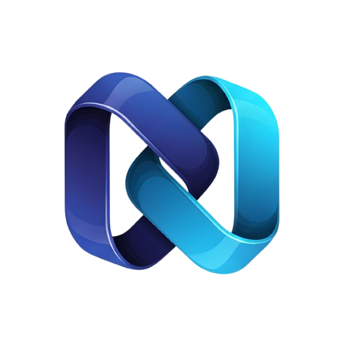

<!-- Animated & Twinkling Header Banner -->

  

<!-- Live Telemetry & Real-Time Profile Status -->

  
  
  

<!-- Futuristic Orbitron Typing Animation -->

  

<!-- Animated Developer Illustration -->

  

<!-- Animated Neon Wave Transition -->

  

<!-- Executive Summary & About Me -->

  <h3>⚡ <em>"Architecting intelligent web platforms & scalable AI infrastructures to bridge disruptive technology with enterprise excellence."</em> ⚡</h3>

 

  Welcome to my operational command center. I am an seasoned <strong>Full-Stack Engineer</strong>, <strong>Artificial Intelligence Researcher</strong>, and the <strong>Founder & CEO of NexoVate Digital</strong>. Based in Karachi, Pakistan 🇵🇰, my work focuses on developing high-concurrency cloud systems, autonomous predictive architectures, and resilient enterprise web applications.

 

<table align="center" width="95%" cellpadding="12">
  <tr>
    <td align="center" width="50%" valign="top">
      <h3>🏢 Executive Leadership</h3>
      
Driving industry digital transformation through state-of-the-art software architectures, custom UI systems, and robust cloud infrastructure at <strong>NexoVate Digital</strong>.

       
      
        
       <strong>NexoVate Digital Ecosystem</strong>
    </td>
    <td align="center" width="50%" valign="top">
      <h3>🎯 Technical Mastery & Vision</h3>
      

        🔹 <code>Architecture</code> : Distributed Scalable Web Systems 
        🔹 <code>Intelligence</code> : Deep Learning & Predictive ML Models 
        🔹 <code>Backend Engine</code> : High-Concurrency Microservices & APIs 
        🔹 <code>Cyber Operations</code> : Defensive Hardening & Ethical Hacking
      

    </td>
  </tr>
</table>

 

<!-- Connect & Network Ribbon -->

  
  
  
  
  

<!-- Animated Neon Wave Transition -->

  

<!-- Technical Arsenal -->
<h2 align="center">🛠️ Ultimate Engineering & Tech Arsenal</h2>

  <em>A specialized stack of modern frameworks, programming languages, and scalable infrastructure tooling.</em>

 

<h3 align="center">🌐 Frontend & Interactive UI Architecture</h3>

  

<h3 align="center">⚙️ Backend Engineering & Database Systems</h3>

  

<h3 align="center">☁️ Cloud Operations, DevOps & Tooling</h3>

  

<!-- Animated Neon Wave Transition -->

  

<!-- Analytics & Performance Metrics -->
<h2 align="center">📊 Real-Time Engineering Analytics & Telemetry</h2>

  <em>Live coding productivity metrics, continuous streak monitoring, and repository contributions.</em>

 

<!-- Streak and General Stats (Custom Cyber Dark Mode) -->

  
  

 

<!-- Language Breakdown & Contribution Habits -->

  
  

 

<!-- Activity Graph -->

  

<!-- Animated Neon Wave Transition -->

  

<!-- Interactive Contribution Matrix -->
<h2 align="center">🐍 Dynamic Contribution Matrix</h2>

  <em>Watch the autonomous GitHub contribution snake consuming daily git activity in real-time!</em>

  <picture>
    <source media="(prefers-color-scheme: dark)" srcset="https://raw.githubusercontent.com/Muhammadd-01/Muhammadd-01/output/github-snake-dark.svg" />
    <source media="(prefers-color-scheme: light)" srcset="https://raw.githubusercontent.com/Muhammadd-01/Muhammadd-01/output/github-snake.svg" />
    
  </picture>

<!-- Animated Neon Wave Transition -->

  

<!-- Consolidated Achievements & Top Repos -->
<h2 align="center">🏆 Milestones & Top Repository Footprint</h2>

  

 

  

<!-- Animated Neon Wave Transition -->

  

<!-- Personal Dimension & Daily Quote -->
<table align="center" width="95%" cellpadding="10">
  <tr>
    <td width="55%" valign="top">
      <h3>🚀 Beyond The Console</h3>
      

        🔹 <code>Core Stack</code> : React, Angular, Node.js, Python & Cloud AI  
        🔹 <code>AI & ML Research</code> : Designing autonomous agents & intelligent architectures  
        🔹 <code>Cybersecurity</code> : Passionate about offensive security and web hardening  
        🔹 <code>Philosophical Research</code> : Exploring Islamic history, teachings, mystique & investigative historical case studies  
        🔹 <code>Recreation</code> : Tactical gaming & continuous exploratory hacking
      

    </td>
    <td width="45%" valign="top" align="center">
      <h3>💡 Daily Developer Wisdom</h3>
        
      
    </td>
  </tr>
</table>

 

<!-- Animated Twinkling Footer Banner -->

  

